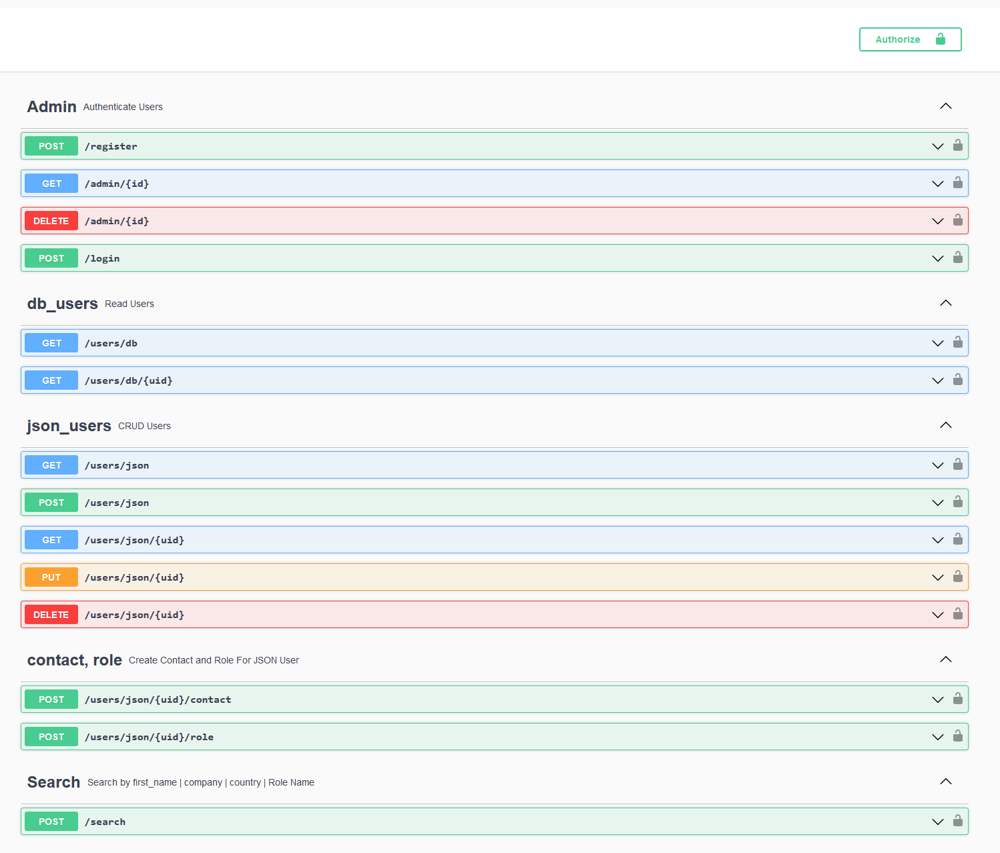

### Local Run Instructions
Clone the project and run the following commands in the terminal
```bash 
python -m venv venv 
```
Activate the virtual environment
```bash 
source venv/bin/activate OR .\venv\Scripts\activate
```
Install Dependencies
```bash 
pip install -r requirements.txt 
```
Seed Database
```bash 
flask db seed 
```
Run the App

```bash 
flask run
```
We can now access and perform actions via 
```bash 
127.0.0.1:5000/swagger-ui
```


### One-liner Docker instruction 
The below command will start two containers one for flask and another for mysql,
It will also populate the database in the container. Please check [127.0.0.1:5005/swagger-ui](http://127.0.0.1:5005/swagger-ui)
after the containers have started. 
```bash
docker-compose up
```

### Project Sample
